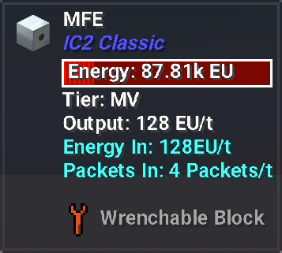
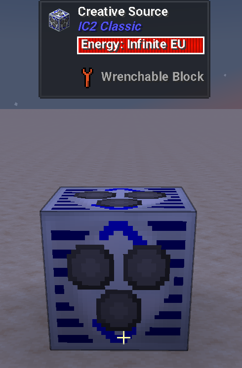
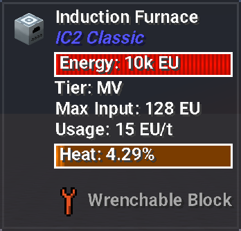
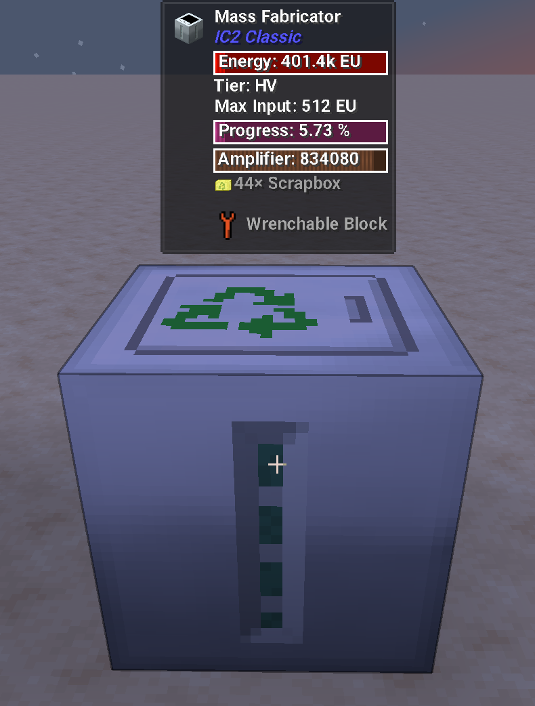
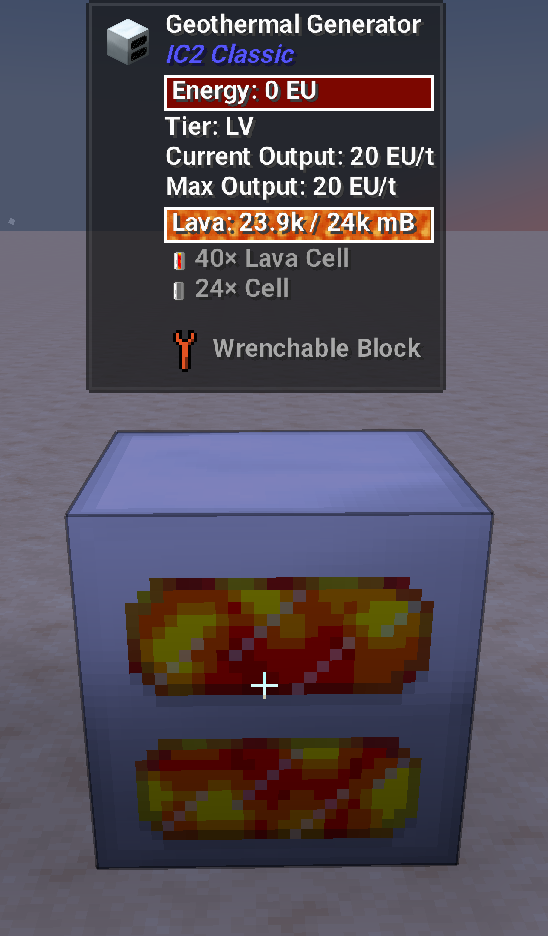
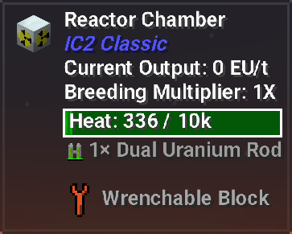
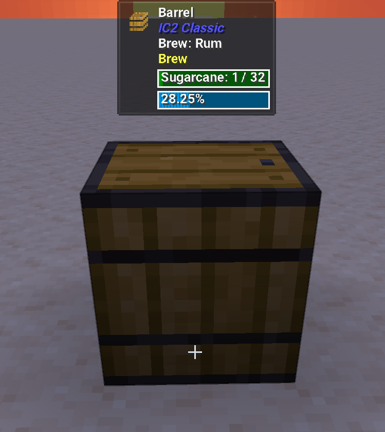
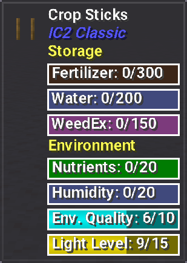
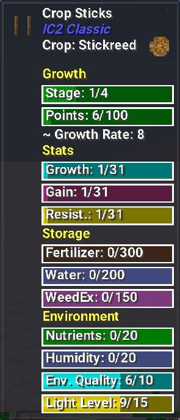

**Jade Plugin For IC2Classic - Minecraft 1.19.2**

**Qui quaerit, reperit...**

### About 

**This addon is meant to provide additional info about IC2Classic machines/blocks when Jade mod is loaded.**

**EU-Reader will provide you: **

- Wrenchable Info: Drop Chance
- EU Storage Info: Energy Level
- Machine Info: Tier, Max Input, Usage
- Advanced Machine Info: Tier, Max Input, Usage, Special Stat Level (Heat, Rotation, Material, Amplifier, etc.)
- Generator Info: Tier, Current Output, Max Output 
- Energy Storage Block Info: Tier, Output, Energy Flow
- Cables Info: Flow Capacity, Loss, Energy Flow
- Tubes Info: Item Flow

 
 
 
 
 
 

**Thermometer will provide you: **

- Reactor Heat Level Info
- Barrel Detailed Info

 
 

**Crop Analyzer will provide you: **

- Crop Stick Info
- Crop Stick Crop Info oO

 
 

**Almost every aspect of the mod is covered, except some parts that require much deeper knowledge which I don't possess at this moment.**

**These parts are:**
- several structures (Multiblock Tank, Steam Tunnel) - for more info you'll have to check the main block or the valve, sorry.

**Everything else is working just fine.**

**Make sure to check the Config (NUM0 by default)**

